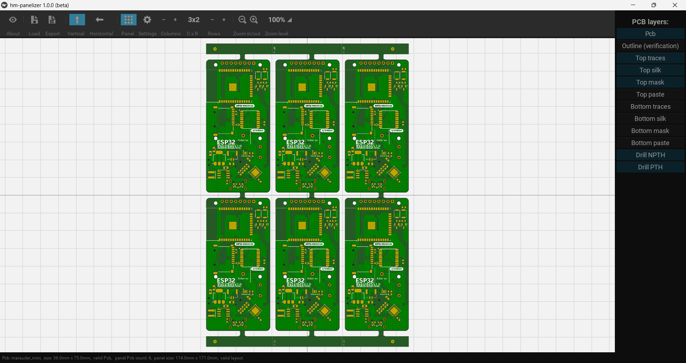

# hm-panelizer


# hm-panelizer (Portable Edition)



[](https://opensource.org)
[](https://github.com)

A standalone, portable version of the **hm-panelizer** tool for creating PCB panels from Gerber files. This fork focuses on ease of use, providing a "plug-and-play" experience for Windows users without requiring a Python environment.

---

## ✨ Features of this Fork

Unlike the original version which requires manual Python setup and dependency management, this fork includes:

*   **Portable Executable:** A single `.exe` file that runs without installation.
*   **Fixed Toolbar Icons:** Corrected internal pathing ensures all UI buttons (Export, Settings, Grid, etc.) render correctly.
*   **Optimized Window Scaling:** Default resolution set to `1280x720` with flexible minimum constraints to ensure the app fits on laptop screens and high-DPI monitors.
*   **All-in-One Bundling:** Includes `Kivy`, `Pygame`, `PyCairo`, and `pcb-tools-extension` out of the box.

## 🚀 Quick Start

1.  Navigate to the **[Releases](https://github.com)** page.
2.  Download the latest `hm-panelizer.exe`.
3.  Double-click to run. 
    *   *Note: On first launch, the app may take a few seconds to initialize as it unpacks into a temporary directory.*

## 🛠 Manual Build Instructions

If you wish to compile the executable yourself:

1.  **Clone the repository:**
    ```bash
    git clone https://github.com
    cd hm-panelizer
    ```
2.  **Install requirements:**
    ```bash
    pip install kivy[base] kivy_deps.sdl2 kivy_deps.glew pygame pycairo pcb-tools-extension Pillow
    ```
3.  **Build the EXE using the provided `.spec` file:**
    ```bash
    python -m PyInstaller --clean main.spec
    ```
4.  Find your portable app in the `/dist` folder.

## 📜 Credits & License

This project is a fork of [hm-panelizer](https://github.com) by **HalfMarble LLC**. 

This software is released under the **MIT License**. See the `LICENSE` file for more details.

 
